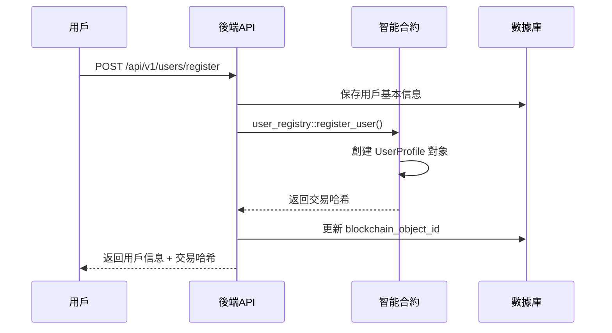
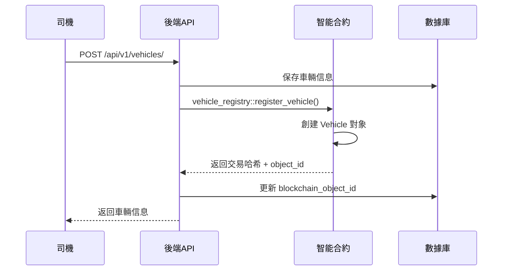
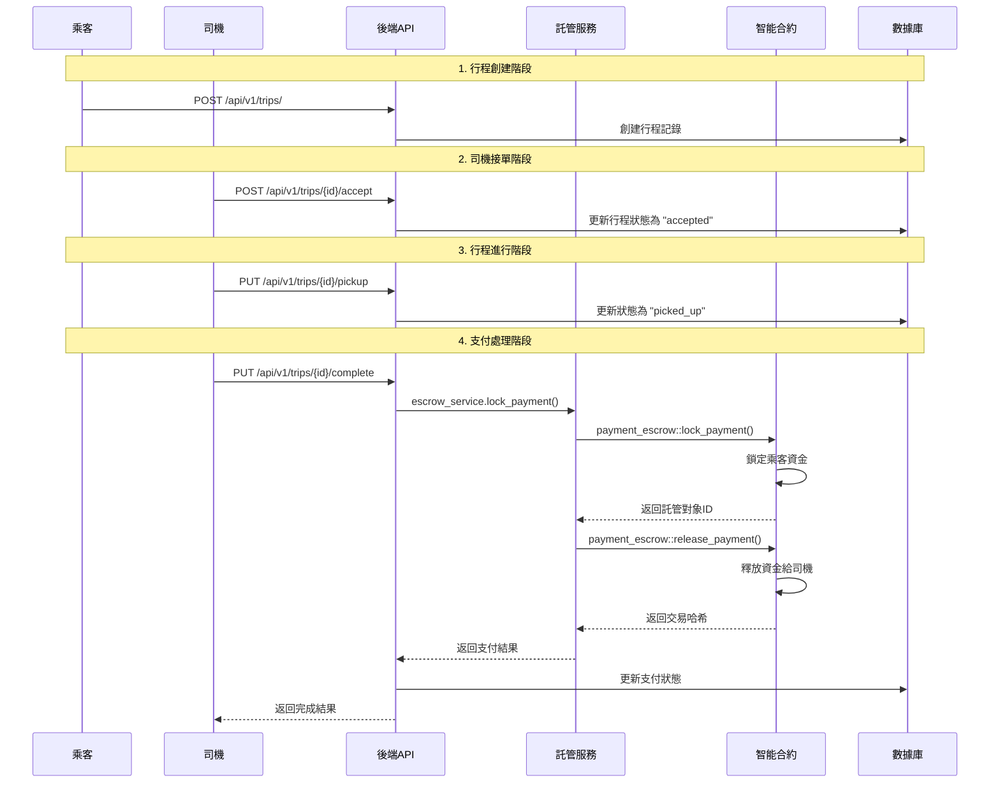
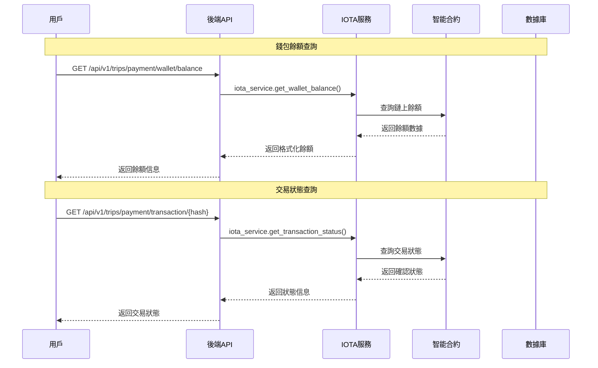
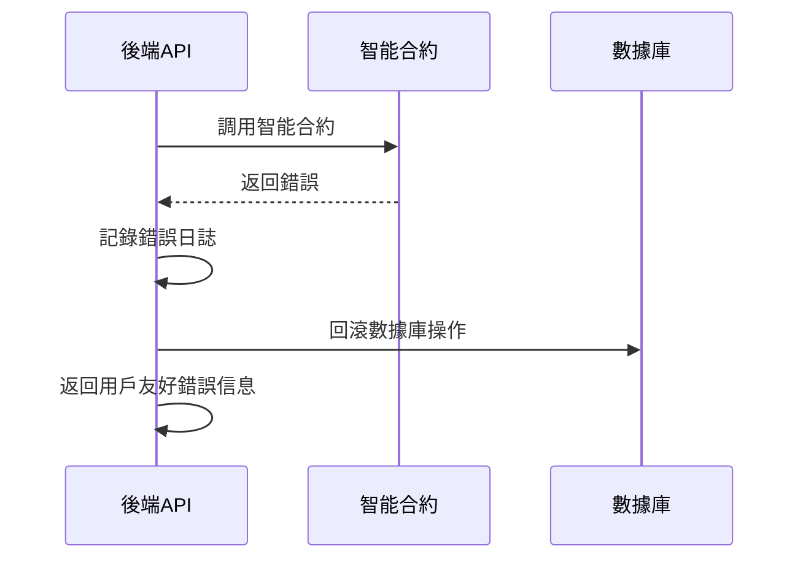

# 🔗 合約層與後端交互流程

## 📋 1. 用戶註冊流程



## 🚗 2. 車輛註冊流程



## 🚕 3. 完整支付流程



## 🔍 4. 數據查詢流程



## 🛠️ 5. 錯誤處理流程



## 📊 6. 關鍵交互點

### A. 數據同步
- **後端 → 合約**: 用戶/車輛註冊時同步
- **合約 → 後端**: 通過事件監聽同步狀態變更
- **雙向驗證**: 關鍵操作需要鏈上和鏈下數據一致性檢查

### B. 狀態管理
- **鏈上狀態**: 用戶信譽、車輛驗證、支付託管
- **鏈下狀態**: 行程詳情、位置信息、實時狀態
- **狀態同步**: 定期同步確保一致性

### C. 安全機制
- **權限驗證**: 合約層驗證調用者身份
- **數據完整性**: 使用哈希驗證關鍵數據
- **資金安全**: 託管合約確保支付安全

## 🔧 7. 配置要點

### 環境變量
```env
# IOTA 網絡配置
IOTA_NODE_URL=https://api.testnet.iota.cafe
IOTA_NETWORK=testnet

# 合約地址
CONTRACT_PACKAGE_ID=0xa353f4acea9dbacd0cc7af37479b277299160d9288495d017ec4d824ea7a5d31
USER_REGISTRY_ID=0x9bdeefc53afba9fca554dc61025514e21fb4e9f9281ad4449bca86f72f18dd5f
VEHICLE_REGISTRY_ID=0xfaf54e90664e669943e07e9845dbd2523e71920b04dd5bf264700a68c1370ce4
```

### Mock 模式
- 開發階段使用 `MOCK_MODE=True`
- 生產環境使用 `MOCK_MODE=False`
- 自動切換真實/模擬區塊鏈調用